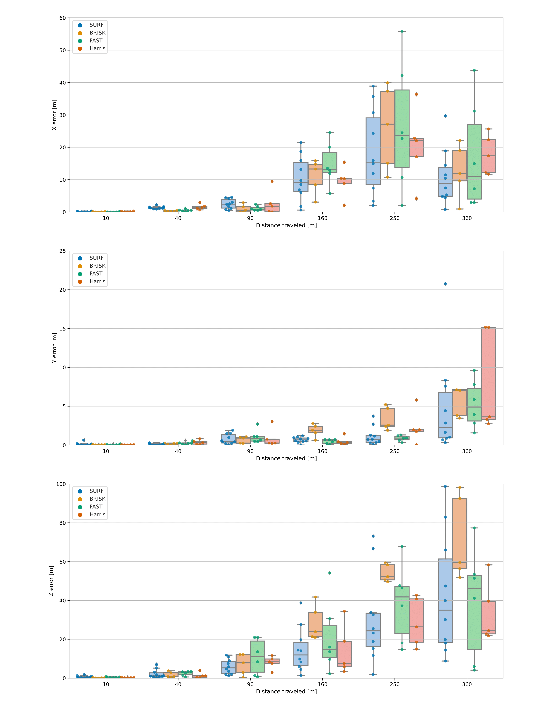

# eval_notebook

## Data

Extract `eval_res.zip` into `data/` subfolder

## Dependencies

- Test passed on Python 3.8 with following libraries
  - numpy
  - pandas
  - matplotlib
  - seaborn
  - scipy

## Example results

### Performance comparison with different features

